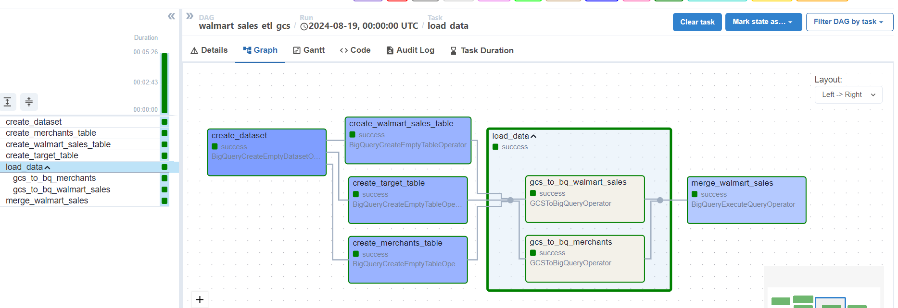

# Walmart Data Ingestion Pipeline

**#dataengineering #bigquery #airflow #python #gcp #datawarehouse**

### Overview
This project outlines a data pipeline for ingesting Walmart data into BigQuery. The pipeline leverages Python, Airflow, GCP Storage, and BigQuery to create dimension and staging tables, followed by an upsert operation into a fact table using a BigQuery Merge query.

### Tech Stack
* Python
* Airflow
* GCP Storage
* BigQuery

### Data Flow
1. **Data Extraction:** Walmart data is extracted from [data source] in [format].
2. **Data Loading:** Extracted data is loaded into GCP Storage.
3. **Data Transformation:** Airflow orchestrates the creation of dimension and staging tables in BigQuery.
4. **Data Loading:** Transformed data is loaded into the respective dimension and staging tables.
5. **Data Integration:** Airflow executes a BigQuery Merge query to upsert data into the fact table based on dimension and staging tables.

### Architecture Diagram
[
]

### Airflow DAG Structure

<!DOCTYPE html>
<html>
<head>
</head>
<body>
  
</body>
</html>

### Code Structure

